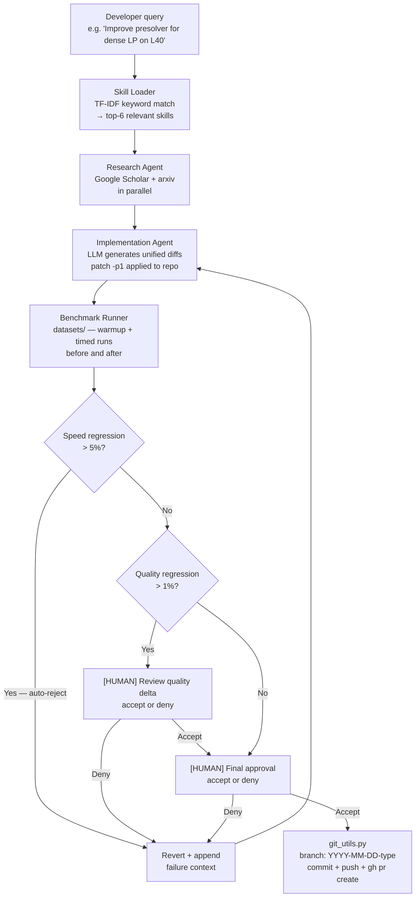

# cuoptopt-agent

An autonomous optimization agent for the NVIDIA cuOpt codebase. Given a natural-language
goal — such as "Improve the presolver for dense LP systems on L40" — the agent searches
recent academic literature, writes targeted code diffs, validates them against cuOpt's
benchmark suite, and opens a GitHub pull request when the results are accepted.

The agent is designed to be run by cuOpt developers who want to explore a performance
improvement without manually doing the literature survey, implementation, and benchmarking
cycle. A human is always in the loop at the quality-check and final-approval steps before
any code lands in the repository.

---

## How It Works



### Step-by-Step

| Step | What happens |
|------|-------------|
| **1. Load skills** | `skill_loader.py` TF-IDF-matches query keywords against the `description` field of every SKILL.md in `cuoptopt-agent/skills/` and `skills/`. Top-6 skill files are read in full and injected into the LLM context. |
| **2. Search literature** | `research.py` runs `scholarly.search_pubs(query)` and `arxiv.Search(query)` in parallel. Rate-limit backoff is applied automatically. Top-5 results from each source are merged, deduplicated by title, and formatted as numbered references. |
| **3. Implement** | `implementation.py` sends the query, skills, paper abstracts, and any prior failure context to the LLM. The LLM responds with one or more `<file>` / `<diff>` block pairs (unified diff format). Each diff is applied via `patch -p1`. |
| **4. Benchmark** | `testing.py` runs cuOpt against the files in `datasets/` (MPS, JSON, QPS, CSV). Two warm-up solves are discarded; five timed solves are taken and the median used. Both solve time and best objective value are captured. |
| **5. Regression check** | Geometric mean of per-instance speed ratios and worst-case quality delta are compared against thresholds. Speed regression triggers automatic revert with the reason appended to the LLM's next prompt. |
| **6. Human review** | Quality regressions pause for human confirmation. If denied, the change is reverted and the loop continues. |
| **7. Final approval** | A clean result (no regression, or quality regression explicitly accepted) is shown to the developer. Approval triggers branch creation, commit, push, and a GitHub PR. |

---

## Getting Started

### 1. Install the agent

From the repo root:

```bash
pip install -e "cuoptopt-agent[dev]"
```

### 2. Set environment variables

| Variable | Required for | Where to get it |
|----------|-------------|----------------|
| `ANTHROPIC_API_KEY` | `--model claude` | [console.anthropic.com](https://console.anthropic.com) |
| `OPENAI_API_KEY` | `--model gpt` | [platform.openai.com](https://platform.openai.com) |
| `NVIDIA_API_KEY` | `--model nvidia` | [build.nvidia.com](https://build.nvidia.com) |
| `GITHUB_TOKEN` | PR creation | GitHub Settings → Developer settings → Personal access tokens (scope: `repo`) |

Only the key for the model you intend to use is required. `GITHUB_TOKEN` is only needed
when a change reaches the final approval step.

```bash
export ANTHROPIC_API_KEY="sk-ant-..."
export GITHUB_TOKEN="ghp_..."
```

### 3. Run your first query

```bash
cuoptopt-agent "Improve presolver for dense LP systems on L40" --model claude
```

The agent will print each step to the terminal. Human-in-the-loop prompts pause and wait
for a `y/n` response.

---

## Launching the Agent

There are three equivalent ways to run the agent.

### Option A — Terminal (CLI)

```bash
# From anywhere in the repo
cuoptopt-agent "your optimization query" --model claude

# From the cuoptopt-agent subdirectory
cd cuoptopt-agent
python -m cuoptopt_agent "your optimization query" --model nvidia
```

### Option B — Cursor Task (no terminal command needed)

1. Press `Ctrl+Shift+P`
2. Type `Tasks: Run Task` and press Enter
3. Choose one of:
   - **cuoptopt-agent: Run (interactive)** — prompts for query and model picker
   - **cuoptopt-agent: Run (skip research, fast)** — skips Scholar/arxiv (useful offline)
   - **cuoptopt-agent: Run (verbose)** — adds debug-level logging
   - **cuoptopt-agent: Install dependencies** — installs the package first time

Cursor will open a dedicated terminal, prompt for the query string, show a model picker
(claude / gpt / nvidia), and run the agent. Human-in-the-loop prompts appear inline.

> Tasks are defined in [`.vscode/tasks.json`](.vscode/tasks.json).

### Option C — Cursor AI Chat (conversational mode)

If the Python package is not installed, the Cursor AI itself can act as the orchestrator.
Start a chat and type your optimization goal. Cursor reads the
[`skills/cuoptopt-agent/SKILL.md`](skills/cuoptopt-agent/SKILL.md) skill (registered in
`AGENTS.md`) and follows the same workflow interactively — browsing code, searching the
web, proposing diffs, and asking for approval in the chat window.

---

## CLI Reference

```
cuoptopt-agent [OPTIONS] QUERY
```

| Flag | Default | Description |
|------|---------|-------------|
| `QUERY` | _(required)_ | Natural-language optimization goal |
| `--model`, `-m` | `claude` | LLM backend: `claude`, `gpt`, or `nvidia` |
| `--max-iter` | `5` | Maximum implement → test → evaluate cycles before stopping |
| `--skip-research` | `false` | Skip Google Scholar / arxiv search (faster, offline-safe) |
| `--verbose`, `-v` | `false` | Enable debug-level logging |
| `--config-dir` | `cuoptopt-agent/config` | Directory containing `models.yaml` and `thresholds.yaml` |
| `--repo-root` | _(auto-detected)_ | Root of the cuOpt repository |

### Examples

```bash
# L40 presolver improvement, Claude, default settings
cuoptopt-agent "Improve presolver for dense LP systems on L40"

# H100 routing kernel, NVIDIA NIM, no literature search
cuoptopt-agent "Speed up VRP kernel memory access on H100" --model nvidia --skip-research

# Blackwell MIP solver, GPT-4o, max 3 attempts
cuoptopt-agent "Optimize branch-and-bound for MILP on B200" --model gpt --max-iter 3

# A100 CUDA kernel, verbose output
cuoptopt-agent "Improve SpMV coalescing for LP solver on A100" --model claude --verbose
```

---

## Regression Policy

The agent enforces two independent regression checks after each candidate implementation.
Both thresholds are configurable in
[`cuoptopt-agent/config/thresholds.yaml`](cuoptopt-agent/config/thresholds.yaml).

| Condition | Threshold | Agent action |
|-----------|-----------|-------------|
| Speed regression | Geometric mean solve time increases > **5%** | Automatic revert; failure reason appended to next LLM prompt; loop continues |
| Quality regression | Worst-case objective value degrades > **1%** | Pauses; shows regression table; asks developer to accept or deny |
| No regression | Both checks pass | Shows summary; asks developer for final approval |

### Why geometric mean for speed?

Arithmetic mean over-weights large instances. Geometric mean of per-instance speed
ratios gives a fair aggregate that represents the multiplicative speedup (or slowdown)
across the benchmark suite.

### Configuring thresholds

```yaml
# cuoptopt-agent/config/thresholds.yaml
speed_tolerance_pct: 5.0       # raise to be more permissive; lower for stricter guard
quality_tolerance_pct: 1.0     # 0.0 means any quality change requires human review
max_reassess_iterations: 5     # increase if the LLM needs more attempts
benchmark_warmup_runs: 2       # GPU warm-up solves (discarded)
benchmark_timed_runs: 5        # timed solves per instance (median used)
```

---

## Skills Catalog

Skills are Markdown files (`SKILL.md`) in `cuoptopt-agent/skills/`. Each file has a YAML
front-matter `description` field. When a query arrives, `skill_loader.py` computes TF-IDF
cosine similarity between the query tokens and every skill description + body, then injects
the top-6 matching skills into the LLM context.

### Available Skills

| Skill directory | Keywords matched | Content |
|----------------|-----------------|---------|
| `cuda-optimization` | cuda, kernel, warp, shared, coalescing, occupancy, async | Memory access patterns, bank conflicts, `cp.async`, cooperative groups, Tensor Core WMMA API, launch config heuristics |
| `nvidia-l40-architecture` | l40, ada, lovelace, gddr6, cc 8.9 | 48 GB GDDR6, 96 MB L2, 4th-gen Tensor Cores, no NVLink, GDDR6 vs HBM bandwidth implications |
| `nvidia-a100-architecture` | a100, ampere, hbm2e, nvlink, mig, cc 8.0 | 80 GB HBM2e, NVLink 3.0, MIG partitioning, `cp.async`, 164 KB shared memory per SM |
| `nvidia-h100-architecture` | h100, h200, hopper, tma, wgmma, fp8, cc 9.0 | 3.35 TB/s HBM3, TMA, thread block clusters, warp specialization, `wgmma` instructions |
| `nvidia-blackwell-architecture` | blackwell, b100, b200, gb200, tcgen05, tmem, fp4, fp6 | Dual-die NV-HBI, 5th-gen Tensor Cores, `tcgen05.mma` single-thread dispatch, Tensor Memory (TMEM) subsystem, FP4/FP6, Decompression Engine, NVLink 5.0 |
| `presolvers` | presolver, bound, tightening, probing, redundancy, clique | Bound tightening, probing, singleton detection, coefficient strengthening, dense system GPU strategies |
| `mip-algorithms` | milp, branch, bound, cutting, planes, gomory, cover, heuristic | B&B, Gomory cuts, cover cuts, clique cuts, primal heuristics, diving, column generation |
| `gpu-profiling` | nsight, ncu, nsys, roofline, bottleneck, stall, occupancy | `nsys` / `ncu` usage, key metrics, roofline model, NVTX annotations, per-solver bottleneck table |
| `benchmarking-methodology` | timing, warmup, median, geomean, thermal, throttling, significance | CUDA event timing, warm-up protocol, statistical significance, thermal throttling mitigation, before/after protocol |
| `research-literature` | scholar, arxiv, paper, query, abstract, literature | How the research agent searches, query construction templates, paper evaluation criteria, key venue list, notable papers |

> The agent also searches the existing `skills/` directory (cuOpt user and developer skills)
> as a fallback, so domain knowledge about routing, LP, MILP, and installation is
> automatically available.

### Adding a New Skill

1. Create the directory: `cuoptopt-agent/skills/<skill-name>/`
2. Create `SKILL.md` with YAML front-matter:

```markdown
---
name: my-new-skill
version: "26.04.00"
description: Short keyword-rich description used for TF-IDF matching.
---

# My New Skill

...content...
```

3. No registration step is required — the file is discovered automatically on next run.

---

## LLM Backends

The agent supports three LLM backends. Switch between them with `--model`.

| Backend | Flag | Model | API compatibility |
|---------|------|-------|------------------|
| Anthropic Claude | `--model claude` | `claude-opus-4-5` | Anthropic SDK |
| OpenAI GPT-4o | `--model gpt` | `gpt-4o` | OpenAI SDK |
| NVIDIA NIM | `--model nvidia` | `nvidia/llama-3.1-nemotron-70b-instruct` | OpenAI-compatible at `https://integrate.api.nvidia.com/v1` |

NVIDIA NIM uses the same `openai` Python SDK as GPT — only the `base_url` and API key
differ. To use a different NIM model, change the `model` field in
[`cuoptopt-agent/config/models.yaml`](cuoptopt-agent/config/models.yaml). Available
models are listed at [build.nvidia.com/explore/discover](https://build.nvidia.com/explore/discover).

### Choosing a backend

- **Claude** — best for complex multi-file reasoning and long-context skill injection; default choice.
- **GPT-4o** — strong code generation; familiar API for OpenAI users.
- **NVIDIA NIM** — preferred when running on NVIDIA infrastructure or when minimizing data leaving NVIDIA systems; `--skip-research` recommended for offline DGX environments.

---

## Pull Request Naming

When a change is accepted, `git_utils.py` creates a branch with this format:

```
YYYY-MM-DD-{type}
```

For example: `2026-03-15-presolve` or `2026-03-15-cuda-kernel`.

The `{type}` is inferred from keywords in the original query:

| Type suffix | Query keywords that trigger it |
|-------------|-------------------------------|
| `presolve` | presolver, presolve, bound-tightening, probing, redundancy |
| `mip-solver` | branch-and-bound, cutting-plane, bab, milp, mip, integer |
| `lp-solver` | simplex, pdlp, lp, linear-program, dual, primal |
| `routing` | vrp, tsp, pdp, routing, vehicle |
| `cuda-kernel` | cuda, kernel, gpu, warp, shared-memory, tensor-core, sm |
| `qp-solver` | qp, quadratic, portfolio |
| `memory` | memory, coalescing, bandwidth, cache, hbm |
| `optimization` | _(fallback for unmatched queries)_ |

The PR body is automatically populated with: a benchmark delta table, the LLM's
reasoning text, and numbered citations for the papers found during literature search.

---

## Configuration Reference

### `cuoptopt-agent/config/models.yaml`

Defines the LLM backends. **Never put API keys directly in this file** — the
`api_key_env` field names the environment variable the agent reads.

```yaml
claude:
  provider: anthropic
  model: claude-opus-4-5        # change to claude-haiku-3-5 for faster/cheaper runs
  api_key_env: ANTHROPIC_API_KEY
  max_tokens: 8192
  temperature: 0.2              # low temperature = more deterministic diffs

gpt:
  provider: openai
  model: gpt-4o
  api_key_env: OPENAI_API_KEY
  max_tokens: 8192
  temperature: 0.2

nvidia:
  provider: nvidia_nim
  base_url: https://integrate.api.nvidia.com/v1
  model: nvidia/llama-3.1-nemotron-70b-instruct
  api_key_env: NVIDIA_API_KEY
  max_tokens: 8192
  temperature: 0.2
```

### `cuoptopt-agent/config/thresholds.yaml`

```yaml
speed_tolerance_pct: 5.0       # auto-reject if geometric mean solve time > 5% slower
quality_tolerance_pct: 1.0     # ask human if any instance objective > 1% worse
max_reassess_iterations: 5     # stop after this many failed attempts
benchmark_warmup_runs: 2       # warm-up solves before timing (GPU JIT warm-up)
benchmark_timed_runs: 5        # timed solves per instance; median reported
datasets_root: datasets        # path relative to repo root
supported_extensions:          # file types included in benchmarks
  - .mps
  - .json
  - .qps
  - .csv
```

---

## Repository Layout

```
cuopt-opt/
├── CUOPT-OPT-AGENT.md          ← this file
├── AGENTS.md                   ← AI agent skill index (includes cuoptopt-agent entry)
├── .vscode/
│   └── tasks.json              ← Cursor launch tasks
├── skills/
│   └── cuoptopt-agent/
│       └── SKILL.md            ← Cursor AI conversational skill
├── datasets/                   ← benchmark instances (MPS, JSON, QPS, CSV)
│   ├── linear_programming/
│   ├── mixed_integer_programming/
│   ├── mip/
│   ├── quadratic_programming/
│   └── distance_engine/
└── cuoptopt-agent/             ← agent source code
    ├── pyproject.toml
    ├── README.md
    ├── config/
    │   ├── models.yaml
    │   └── thresholds.yaml
    ├── cuoptopt_agent/
    │   ├── main.py             ← CLI entry point
    │   ├── orchestrator.py     ← top-level workflow loop
    │   ├── skill_loader.py     ← TF-IDF skill matcher
    │   ├── research.py         ← Scholar + arxiv search
    │   ├── implementation.py   ← LLM diff generation + patch application
    │   ├── testing.py          ← benchmark runner + regression detection
    │   ├── models.py           ← unified LLM client
    │   └── git_utils.py        ← branch + commit + PR
    └── skills/
        ├── cuda-optimization/
        ├── nvidia-l40-architecture/
        ├── nvidia-a100-architecture/
        ├── nvidia-h100-architecture/
        ├── nvidia-blackwell-architecture/
        ├── presolvers/
        ├── mip-algorithms/
        ├── gpu-profiling/
        ├── benchmarking-methodology/
        └── research-literature/
```

---

## Example Queries

The following examples illustrate the range of improvement goals the agent supports.

```bash
# Dense LP presolve on L40 (the motivating example)
cuoptopt-agent "Improve presolver for relatively dense systems of inequalities on L40"

# Memory access on A100
cuoptopt-agent "Improve SpMV kernel memory coalescing in the PDLP LP solver on A100" \
  --model claude

# Branch-and-bound on Hopper
cuoptopt-agent "Speed up branch-and-bound node processing for MILP on H100" \
  --model nvidia

# Blackwell-specific Tensor Core usage
cuoptopt-agent "Exploit Blackwell tcgen05 Tensor Cores in LP residual computation on B200" \
  --model claude --max-iter 3

# Routing kernel on H100
cuoptopt-agent "Optimize VRP distance matrix kernel for better L2 reuse on H100" \
  --model gpt

# QP solver
cuoptopt-agent "Reduce quadratic programming solve time for portfolio problems on A100" \
  --model nvidia --skip-research

# Generic CUDA optimization (no specific GPU)
cuoptopt-agent "Reduce warp divergence in the MILP cutting plane separation kernel" \
  --model claude --verbose

# Fast offline iteration (no literature search)
cuoptopt-agent "Improve shared memory usage in the routing kernel" \
  --model nvidia --skip-research --max-iter 2
```

---

## Troubleshooting

### "Environment variable X is not set"
Export the required API key for your chosen model before running. See the
[Getting Started](#getting-started) table.

### "No matching skills found"
The query keywords did not match any skill descriptions. Try adding more specific
technical terms (e.g., "CUDA", "presolver", "branch-and-bound", "L40").

### "Changes could not be applied"
The LLM generated a diff that did not apply cleanly. The agent will retry with the
error included in the next prompt. If this persists, run with `--verbose` to inspect
the raw diff.

### Google Scholar blocked / slow
Run with `--skip-research` to bypass Scholar and use only the skills. This is the
recommended mode in data-center environments without outbound internet access.

### "Maximum iterations reached"
The agent failed to find an accepted improvement within `max_reassess_iterations`
attempts. Increase `--max-iter`, relax `speed_tolerance_pct` in `thresholds.yaml`,
or refine the query to be more specific.
