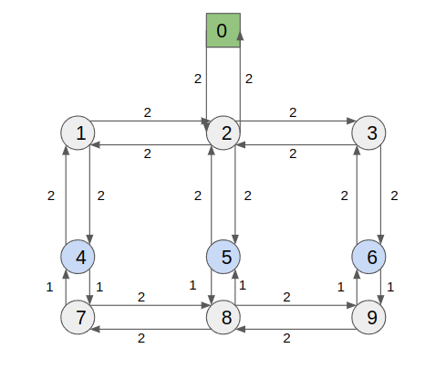

========================================
Routing Examples
========================================

This section contains examples for the cuOpt routing Python API.

Intra-factory Transport
-----------------------

A capacitated pickup-and-delivery problem with time windows (PDPTW) for a fleet
of autonomous mobile robots (AMRs) moving parts between processing stations on a
factory floor. The example uses :class:`cuopt.distance_engine.WaypointMatrix` to
derive a cost matrix from a weighted waypoint graph, sets up pickup/delivery
orders with demand and time windows, solves with :func:`cuopt.routing.Solve`,
and expands the target-location route back to a waypoint-level route per robot.

**Problem details:**

- 4 target locations: 1 start location for AMRs and 3 processing stations
- 6 transport orders (pickup/delivery pairs) with individual time windows
- 2 AMRs, each with a carrying capacity of 2 parts
- Factory hours: 0 to 100 time units

:download:`intra_factory_example.py <examples/intra_factory_example.py>`

.. literalinclude:: examples/intra_factory_example.py
   :language: python
   :linenos:

TSP Batch Mode
--------------

The routing Python API supports **batch mode** for solving many TSP (or routing) instances in a single call. Instead of calling :func:`cuopt.routing.Solve` repeatedly, you build a list of :class:`cuopt.routing.DataModel` objects and call :func:`cuopt.routing.BatchSolve`. The solver runs the problems in parallel to improve throughput.

**When to use batch mode:**

- You have **many similar routing problems** (e.g., dozens or hundreds of small TSPs).
- You want to **maximize throughput** by utilizing the GPU across multiple problems at once.
- Problem sizes and structure are compatible with the same :class:`cuopt.routing.SolverSettings` (e.g., same time limit).

**Returns:** A list of :class:`cuopt.routing.Assignment` objects, one per input data model, in the same order as ``data_model_list``. Use :meth:`cuopt.routing.Assignment.get_status` and other assignment methods to inspect each solution.

The following example builds several TSPs of different sizes, solves them in one batch, and prints a short summary per solution.

:download:`tsp_batch_example.py <examples/tsp_batch_example.py>`

.. literalinclude:: examples/tsp_batch_example.py
   :language: python
   :linenos:

Sample output:

.. code-block:: text

   Solved 6 TSPs in batch.
     TSP 0 (size 5): status=SUCCESS, vehicles=1
     TSP 1 (size 8): status=SUCCESS, vehicles=1
     TSP 2 (size 10): status=SUCCESS, vehicles=1
     ...

**Notes:**

- All problems in the batch use the **same** :class:`cuopt.routing.SolverSettings` (e.g., time limit, solver options).
- Callbacks are not supported in batch mode.
- For best practices when batching many instances, see the *Add best practices for batch solving* note in the release documentation.

EV Charging Breaks
------------------

Electric vehicles require mandatory charging stops when their battery approaches depletion.
:meth:`cuopt.routing.DataModel.add_ev_break` models this as a **distance-triggered break**:
the solver must insert one charging stop per cycle within the window
``[k * max_range + min_range, (k+1) * max_range]`` for each cycle ``k``.

**Problem details:**

- 9 locations: 1 depot, 5 customer delivery points, 3 charging stations (A, B, C)
- 2 electric vans, ``min_range=0``, ``max_range=75`` km between charges
- 5 delivery orders (one per customer)
- ``n_cycles=5``: each van makes five charging stops per route within the windows
  ``[0, 75)``, ``[75, 150)``, ``[150, 225)``, ``[225, 300)``, and ``[300, 375)`` km
  of cumulative route distance

Charging stations A (60 km), B (135 km), and C (210 km) cover the first three windows.
The solver reuses them for the later windows as the route doubles back after the
furthest customer.

:download:`ev_break_example.py <examples/ev_break_example.py>`

.. literalinclude:: examples/ev_break_example.py
   :language: python
   :linenos:

Sample output:

.. code-block:: text

   Total route cost: 446.9 km
   Vehicles used:    1

   Vehicle 0:
     Depot       depot
     Break       charger A
     Delivery    customer 1
     Break       charger B
     Delivery    customer 2
     Break       charger C
     Delivery    customer 5
     Break       charger C
     Delivery    customer 4
     Break       charger B
     Delivery    customer 3
     Depot       depot

**Notes:**

- The charge window for cycle ``k`` is ``[k * max_range + min_range, (k+1) * max_range]``.
  Set ``min_range > 0`` to prevent consecutive charges at the start of a route (the default
  ``min_range=0`` allows a charge immediately after leaving the depot).
- ``charging_stations`` limits which locations the solver may use for a charging stop.
  Omit it to allow any location.
- Each call to :meth:`~cuopt.routing.DataModel.add_ev_break` applies the same schedule
  to all ``vehicle_ids``. Call it again with a different ``max_range`` or ``n_cycles`` to
  model a mixed fleet with different battery capacities.
- ``charge_duration`` uses the same unit as order service times.
